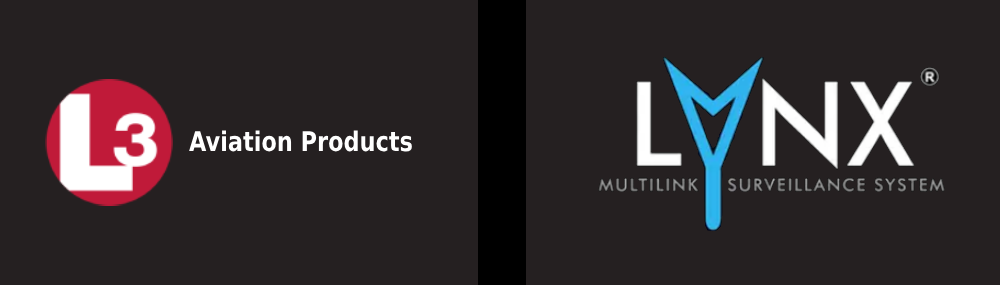

  <h3 align="center">Air Manager LYNX NGT-9000 XPNDR ADS-B</h3>
  

    Instrument for Air Manager platform for personal entertainment / non-commercial use
  

## Features
* Displays boot sequence and prompts user to enter flight ID. Keyboard entry is not finished yet.
* Currently the unit is powered on by setting dataref skyvan/electrical/essential_services_volts_1 to 8 or more (volts). Change this dataref if you are using it with another airplane type then Skyvan.
* No further functionality apart from the boot sequence and flight ID entry is done yet. No transponder/ADSB functionality yet, did not have enough motivation to finish this. Could be finished if needed. Manual is attached in the Resources folder.

## Installation of official Release version
If there is an official Release version of this instrument available, you can download it by clicking the link in the Releases section. It will download a <i>.siff</i> file — that is the instrument. Use Air Manager’s "Import" function to import this instrument.

If there is no official Release version of this instrument available, it is usually because it is still in development. In that case, read further.

## Installation from GitHub source
Click **Code → Download ZIP**. The download will begin for a ZIP archive (e.g. xxxyyy.zip). When the download is finished, open the ZIP file and you will find a subfolder inside with a similar name. This subfolder should include the files <i>logic.lua</i>, a folder named <i>resources</i>, and possibly other files. Go to your <code>C:\Users\username\Air Manager\instruments\OPEN_DIRECTORY</code> and create a folder named <b>5daa3b7c-6dec-46d5-9597-81aff0b315aa</b> (that is your Air Manager hash for this instrument). Copy all the files you just downloaded (<i>logic.lua</i>, the <i>resources</i> folder, etc.) directly into this hash folder. Then run Air Manager, which should immediately discover this new instrument.

## Contributing
If you have a suggestion that would make this better, please fork the repo and create a pull request. You can also simply open an issue with the tag "enhancement".
Don't forget to give the project a star! Thanks again!

1. Fork the Project
2. Create your Feature Branch (`git checkout -b feature/AmazingFeature`)
3. Commit your Changes (`git commit -m 'Add some AmazingFeature'`)
4. Push to the Branch (`git push origin feature/AmazingFeature`)
5. Open a Pull Request

## License
This project is licensed under the Creative Commons Attribution–NonCommercial 4.0 International License. Commercial use is prohibited without prior written permission.

## Contact
If you need to contact me, use any of the social network profiles linked from my GitHub. I usually reply within one day.

## Acknowledgments
* [Sim Innovations Air Manager](https://www.siminnovations.com/)

    

